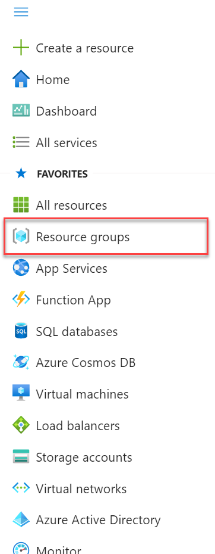

Leveraging Azure Digital Twins in a supply chain

Before the hands-on lab setup guide

May 2021

Information in this document, including URL and other Internet Web site references, is subject to change without notice. Unless otherwise noted, the example companies, organizations, products, domain names, e-mail addresses, logos, people, places, and events depicted herein are fictitious, and no association with any real company, organization, product, domain name, e-mail address, logo, person, place or event is intended or should be inferred. Complying with all applicable copyright laws is the responsibility of the user. Without limiting the rights under copyright, no part of this document may be reproduced, stored in or introduced into a retrieval system, or transmitted in any form or by any means (electronic, mechanical, photocopying, recording, or otherwise), or for any purpose, without the express written permission of Microsoft Corporation.

Microsoft may have patents, patent applications, trademarks, copyrights, or other intellectual property rights covering subject matter in this document. Except as expressly provided in any written license agreement from Microsoft, the furnishing of this document does not give you any license to these patents, trademarks, copyrights, or other intellectual property.

The names of manufacturers, products, or URLs are provided for informational purposes only and Microsoft makes no representations and warranties, either expressed, implied, or statutory, regarding these manufacturers or the use of the products with any Microsoft technologies. The inclusion of a manufacturer or product does not imply endorsement of Microsoft of the manufacturer or product. Links may be provided to third party sites. Such sites are not under the control of Microsoft and Microsoft is not responsible for the contents of any linked site or any link contained in a linked site, or any changes or updates to such sites. Microsoft is not responsible for webcasting or any other form of transmission received from any linked site. Microsoft is providing these links to you only as a convenience, and the inclusion of any link does not imply endorsement of Microsoft of the site or the products contained therein.

© 2021 Microsoft Corporation. All rights reserved.

Microsoft and the trademarks listed at <https://www.microsoft.com/en-us/legal/intellectualproperty/Trademarks/Usage/General.aspx> are trademarks of the Microsoft group of companies. All other trademarks are property of their respective owners.

**Contents**

<!-- TOC -->
- [Leveraging Azure Digital Twins in a supply chain before the hands-on lab setup guide](#leveraging-azure-digital-twins-in-a-supply-chain-before-the-hands-on-lab-setup-guide)
  - [Requirements](#requirements)
  - [Before the hands-on lab](#before-the-hands-on-lab)
    - [Task 1: Create the lab resource group](#task-1-create-the-lab-resource-group)
    - [Task 2: Deploy the necessary Azure resources](#task-2-deploy-the-necessary-azure-resources)
  - [Task 3: Download the lab files](#task-3-download-the-lab-files)
<!-- /TOC -->

# Leveraging Azure Digital Twins in a supply chain before the hands-on lab setup guide

## Requirements

1. Azure Subscription with the following permissions or capabilities:

   - Create and manage Azure resources

   - Manage user access to Azure resources (including granting and delegating permissions)

    > **Note**: Common roles that meet this requirement are Owner, Account admin, or the combination of User Access Administrator and Contributor.

2. [Azure CLI 2.3.1+](https://docs.microsoft.com/en-us/cli/azure/install-azure-cli)

3. PowerShell ([macOS](https://docs.microsoft.com/en-us/powershell/scripting/install/installing-powershell-core-on-macos?view=powershell-6&preserve-view=true)) (Windows: PowerShell is built in)

4. [Visual Studio Code](https://code.visualstudio.com/)

5. [.NET Core 3.1](https://dotnet.microsoft.com/download)

6. [C# Visual Studio Code Extension](https://marketplace.visualstudio.com/items?itemName=ms-dotnettools.csharp)

7. [Node.js 10+](https://nodejs.org/)

## Before the hands-on lab

Duration: 25 minutes

### Task 1: Create the lab resource group

1. In the [Azure Portal](https://portal.azure.com), expand the left menu and select **Resource groups**.

    

2. Select **+ Add** from the top toolbar menu, and create a resource group for this lab. Name the resource group: **mcw-adt-supply-chain**.

3. For the **Region**, select a [region that supports Azure Digital Twins](https://azure.microsoft.com/en-us/global-infrastructure/services/).

### Task 2: Deploy the necessary Azure resources

1. Deploy the ARM template (CTRL/Command + left click the image below to open in a new tab):

    

2. Configure the following fields:

    | Field | Value |
    |--------|--------|
    | Subscription | Select the desired subscription. |
    | Resource group | Select the lab resource group you created in the previous step. |
    | Location | Select the Region where to deploy the resources. Keep in mind that all resources will be deployed to this region. |
    | Prefix | The template will generate a unique ID once you start your deployment. Alternatively, you can enter your own prefix. |

3. Select **Review + create**.

4. Select **Create**.

This ARM template will deploy the services necessary to support this lab. You can refer to the Solution architecture in the Hands-on lab for a visualization. The services deployed include:

1. Azure Digital Twins

2. Function App

3. Event Grid Topic

4. Event Hubs Namespace

5. IoT Hub

6. App Service plan

7. Logic app

8. Storage account

9. Time Series Insights environment

10. Time Series Insights event source

11. SignalR

## Task 3: Download the lab files

Download the lab artifacts from GitHub.

1. In a web browser, navigate to the [Leveraging Azure Digital Twins in a supply chain GitHub repo](https://github.com/solliancenet/microsoft-leveraging-azure-digital-twins-supply-chain).

2. On the repo page, expand the **Code**, then select **Download ZIP**.

   

3. Unzip the contents to your root hard drive (i.e., `C:\`).

You should follow all steps provided *before* performing the Hands-on lab.
