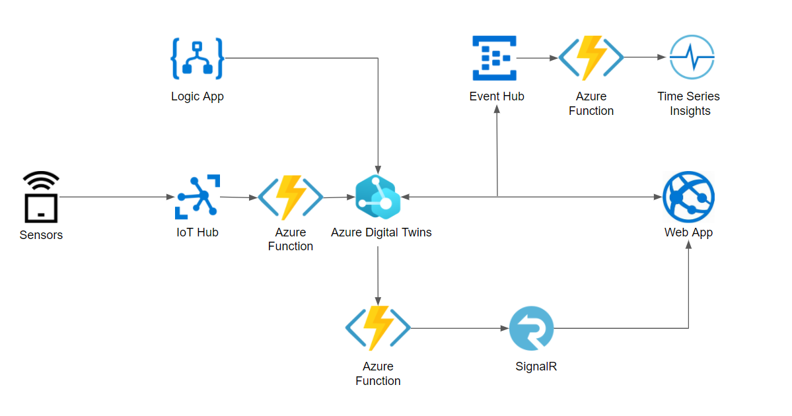
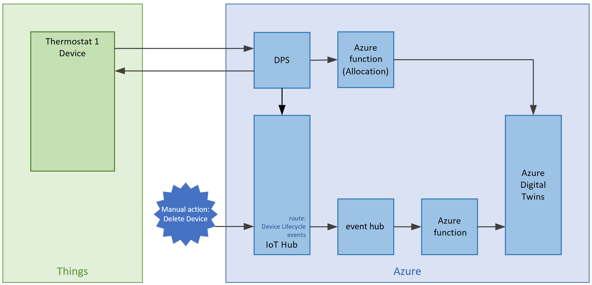
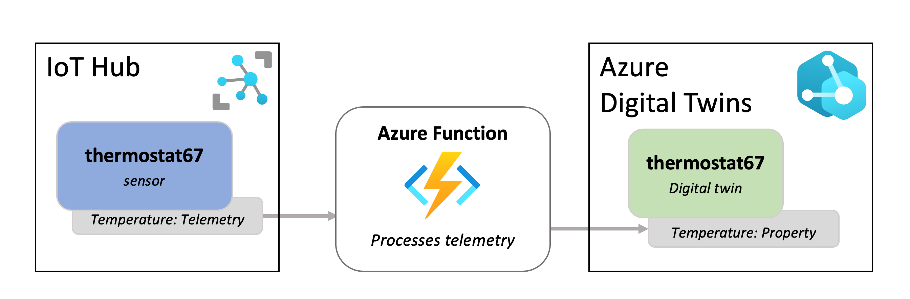

Leveraging Azure Digital Twins in a supply chain

Whiteboard design session trainer guide

May 2021

Information in this document, including URL and other Internet Web site references, is subject to change without notice. Unless otherwise noted, the example companies, organizations, products, domain names, e-mail addresses, logos, people, places, and events depicted herein are fictitious, and no association with any real company, organization, product, domain name, e-mail address, logo, person, place or event is intended or should be inferred. Complying with all applicable copyright laws is the responsibility of the user. Without limiting the rights under copyright, no part of this document may be reproduced, stored in or introduced into a retrieval system, or transmitted in any form or by any means (electronic, mechanical, photocopying, recording, or otherwise), or for any purpose, without the express written permission of Microsoft Corporation.

Microsoft may have patents, patent applications, trademarks, copyrights, or other intellectual property rights covering subject matter in this document. Except as expressly provided in any written license agreement from Microsoft, the furnishing of this document does not give you any license to these patents, trademarks, copyrights, or other intellectual property.

The names of manufacturers, products, or URLs are provided for informational purposes only and Microsoft makes no representations and warranties, either expressed, implied, or statutory, regarding these manufacturers or the use of the products with any Microsoft technologies. The inclusion of a manufacturer or product does not imply endorsement of Microsoft of the manufacturer or product. Links may be provided to third party sites. Such sites are not under the control of Microsoft and Microsoft is not responsible for the contents of any linked site or any link contained in a linked site, or any changes or updates to such sites. Microsoft is not responsible for webcasting or any other form of transmission received from any linked site. Microsoft is providing these links to you only as a convenience, and the inclusion of any link does not imply endorsement of Microsoft of the site or the products contained therein.

© 2021 Microsoft Corporation. All rights reserved.

Microsoft and the trademarks listed at <https://www.microsoft.com/en-us/legal/intellectualproperty/Trademarks/Usage/General.aspx> are trademarks of the Microsoft group of companies. All other trademarks are property of their respective owners.

**Contents**

<!-- TOC -->

- [Trainer information](#trainer-information)
  - [Role of the trainer](#role-of-the-trainer)
  - [Whiteboard design session flow](#whiteboard-design-session-flow)
  - [Before the whiteboard design session: How to prepare](#before-the-whiteboard-design-session-how-to-prepare)
  - [During the whiteboard design session: Tips for an effective whiteboard design session](#during-the-whiteboard-design-session-tips-for-an-effective-whiteboard-design-session)
- [Leveraging Azure Digital Twins in a supply chain whiteboard design session student guide](#leveraging-azure-digital-twins-in-a-supply-chain-whiteboard-design-session-student-guide)
  - [Abstract and learning objectives](#abstract-and-learning-objectives)
  - [Step 1: Review the customer case study](#step-1-review-the-customer-case-study)
    - [Customer situation](#customer-situation)
    - [Customer needs](#customer-needs)
    - [Customer objections](#customer-objections)
    - [Infographic for common scenarios](#infographic-for-common-scenarios)
  - [Step 2: Design a proof of concept solution](#step-2-design-a-proof-of-concept-solution)
  - [Step 3: Present the solution](#step-3-present-the-solution)
  - [Wrap-up](#wrap-up)
  - [Additional references](#additional-references)
- [Leveraging Azure Digital Twins in a supply chain whiteboard design session trainer guide](#leveraging-azure-digital-twins-in-a-supply-chain-whiteboard-design-session-trainer-guide)
  - [Step 1: Review the customer case study](#step-1-review-the-customer-case-study-1)
  - [Step 2: Design a proof of concept solution](#step-2-design-a-proof-of-concept-solution-1)
  - [Step 3: Present the solution](#step-3-present-the-solution-1)
  - [Wrap-up](#wrap-up-1)
  - [Preferred target audience](#preferred-target-audience)
  - [Preferred solution](#preferred-solution)
  - [Checklist of preferred objection handling](#checklist-of-preferred-objection-handling)
  - [Customer quote (to be read back to the attendees at the end)](#customer-quote-to-be-read-back-to-the-attendees-at-the-end)

<!-- /TOC -->

# Trainer information

Thank you for taking time to support the whiteboard design sessions as a trainer!

## Role of the trainer

An amazing trainer:

- Creates a safe environment in which learning can take place.

- Stimulates the participant's thinking.

- Involves the participant in the learning process.

- Manages the learning process (on time, on topic, and adjusting to benefit participants).

- Ensures individual participant accountability.

- Ties it all together for the participant.

- Provides insight and experience to the learning process.

- Effectively leads the whiteboard design session discussion.

- Monitors quality and appropriateness of participant deliverables.

- Effectively leads the feedback process.

## Whiteboard design session flow

Each whiteboard design session uses the following flow:

**Step 1: Review the customer case study (15 minutes)**

**Outcome**

Analyze your customer's needs.

- Customer's background, situation, needs and technical requirements

- Current customer infrastructure and architecture

- Potential issues, objectives and blockers

**Step 2: Design a proof of concept solution (60 minutes)**

**Outcome**

Design a solution and prepare to present the solution to the target customer audience in a 15-minute chalk-talk format.

- Determine your target customer audience.

- Determine customer's business needs to address your solution.

- Design and diagram your solution.

- Prepare to present your solution.

**Step 3: Present the solution (30 minutes)**

**Outcome**

Present solution to your customer:

- Present solution

- Respond to customer objections

- Receive feedback

**Wrap-up (15 minutes)**

- Review preferred solution

## Before the whiteboard design session: How to prepare

Before conducting your first whiteboard design session:

- Read the Student guide (including the case study) and Trainer guide.

- Become familiar with all key points and activities.

- Plan the point you want to stress, which questions you want to drive, transitions, and be ready to answer questions.

- Prior to the whiteboard design session, discuss the case study to pick up more ideas.

- Make notes for later.

## During the whiteboard design session: Tips for an effective whiteboard design session

**Refer to the Trainer guide** to stay on track and observe the timings.

**Do not expect to memorize every detail** of the whiteboard design session.

When participants are doing activities, you can **look ahead to refresh your memory**.

- **Adjust activity and whiteboard design session pace** as needed to allow time for presenting, feedback, and sharing.

- **Add examples, points, and stories** from your own experience. Think about stories you can share that help you make your points clearly and effectively.

- **Consider creating a "parking lot"** to record issues or questions raised that are outside the scope of the whiteboard design session or can be answered later. Decide how you will address these issues, so you can acknowledge them without being derailed by them.

***Have fun**! Encourage participants to have fun and share!*

**Involve your participants.** Talk and share your knowledge but always involve your participants, even while you are the one speaking.

**Ask questions** and get them to share to fully involve your group in the learning process.

**Ask first**, whenever possible. Before launching into a topic, learn your audience's opinions about it and experiences with it. Asking first enables you to assess their level of knowledge and experience, and leaves them more open to what you are presenting.

**Wait for responses**. If you ask a question such as, "What's your experience with (fill in the blank)?" then wait. Do not be afraid of a little silence. If you leap into the silence, your participants will feel you are not serious about involving them and will become passive. Give participants a chance to think, and if no one answers, patiently ask again. You will usually get a response.

# Leveraging Azure Digital Twins in a supply chain whiteboard design session student guide

## Abstract and learning objectives

In this whiteboard design session, you will work in a group to evaluate Contoso's goals and design an IoT-based supply chain solution that uses the optimal combination of Azure tools and services that will fulfill their needs. You will also model their physical and logical environment to identify elements along with their properties and define the relationships between them. You will guide Contoso on deploying these models to Azure Digital Twins, how to leverage them and keep them up-to-date.

At the end of this whiteboard design session, you will be better able to design an end-to-end Azure IoT supply chain solution from telemetry ingestion to data insights, all while leveraging Azure Digital Twins.

## Step 1: Review the customer case study

**Outcome**

Analyze your customer's needs.

Timeframe: 15 minutes

Directions: With all participants in the session, the facilitator/SME presents an overview of the customer case study along with technical tips.

1. Meet your table participants and trainer.

2. Read all of the directions for steps 1-3 in the student guide.

3. As a table team, review the following customer case study.

### Customer situation

Contoso Apparel is a large multinational clothing manufacturer. Their environment consists of several factories, warehouses, storefronts, and logistics infrastructure. Multiple telemetry points are measured to ensure the highest quality level in their products, such as temperature, vibration, location, and humidity. Of these readings, maintaining humidity within the range of X and Y at all supply chain levels is the most critical. Due to mold issues, humidity has a direct correlation to the quality of the delivered consumer end-product.

Contoso Apparel is looking to implement an end-to-end IoT solution in Azure. They will need data ingestion, processing, storage, and visualization. For the proof of concept, they wish to track humidity levels at each level of their supply chain to ensure a high-quality consumer product.

Contoso desires to model and visualize the relationship between their processes, products, equipment, factories, shipping logistics, warehouses, and storefronts. They wish to have the ability to query into the current state of each of these elements defined their supply chain environment. They would also like to analyze historical data to track successful product deliveries or determine the root cause of unsuccessful deliveries. They also wish to leverage these models to simulate potential 'what if' process changes and assess their overall impact without experimenting with or impacting the current supply chain.

In this proof of concept project, Contoso Apparel also wants to improve resiliency and time to recover at their factories by automating mitigating measures should an anomalous event occur. For example, product manufacturing could be re-routed to a secondary 'failover' factory should there be a moisture problem at the original facility. Currently, this type of failover is a manual, lengthy, and error-prone process that involves updating several systems and configuration files.

### Customer needs

1. We would like to model our supply chain environment in order to gain insight into the elements along with their properties, components and the relationships between them.

2. We need monitor humidity telemetry from our factories in near real-time for anomalies between the values of X and Y. What services can we put in place so that we can quickly be alerted when this happens?

3. We would like the ability to re-route manufacturing to a different facility should there be a moisture problem at a factory.

4. We need the ability to query the current state of our supply chain elements.

5. We need the ability to review historical trends in data to identify what is working well as well as for root cause analysis of problems. We need to be able to perform ad-hoc queries on this data and obtain customized chart visualizations.

### Customer objections

1. Authoring Digital Twin Definition Language (DTDL) documents for all of our supply chain elements sounds like an enormous and complex undertaking. We don't even know how to get started with this. What do you recommend as a starting point?

2. Our supply chain is a continuously running system, 24 hours a day, 7 days a week. As such, the state of each of our elements is in a constant state of change. How can we ensure the accuracy of our digital models? How will these be kept up-to-date?

3. We want to track a manufactured product such as a T-Shirt from its manufacturing on a factory floor, delivery to a warehouse, then to a store. Finally, we'd like to trace the T-Shirt through its purchase at a store by a customer. Is this level of tracing even possible?

### Infographic for common scenarios

Azure Digital Twins is commonly used in combination with other Azure services as part of a larger IoT solution. A complete solution using Azure Digital Twins may contain the following parts:

1. The Azure Digital Twins service instance. This stores your twin models and your twin graph with its state, and orchestrates event processing.

2. One or more client apps that drive the Azure Digital Twins instance by configuring models, creating topology, and extracting insights from the twin graph.

3. One or more external compute resources to process events generated by Azure Digital Twins, or connected data sources such as devices. One common way to provide compute resources is via Azure Functions.

4. An IoT hub to provide device management and IoT data stream capabilities.
Downstream services to handle tasks such as workflow integration (like Logic Apps, cold storage, time series integration, or analytics).

## Step 2: Design a proof of concept solution

**Outcome**

Design a solution and prepare to present the solution to the target customer audience in a 15-minute chalk-talk format.

Timeframe: 60 minutes

**Business needs**

Directions:  With all participants at your table, answer the following questions and list the answers on a flip chart:

1. Who should you present this solution to? Who is your target customer audience? Who are the decision makers?

2. What customer business needs do you need to address with your solution?

**Design**

Directions: With all participants at your table, respond to the following questions on a flip chart:

*High-level architecture*

1. Without getting into the details (the following sections will address the details), diagram your initial vision for handling the top-level requirements for environment modeling, data ingestion and monitoring, model updates, business logic implementation, and data visualization.

*Environment modeling*

1. As a starting point, how do you recommend Contoso Apparel approach modeling entities in their environment?

2. At a high level, what types of information should be encapsulated within an entity definition?

3. What methods are available for Contoso to add these entities to their environment knowledge graph?

4. How would Contoso query and visualize the knowledge graph representation of their environment model?

*Data ingestion and monitoring*

1. Which Azure service(s) should Contoso use to register and authenticate their IoT devices?

2. How should the IoT telemetry data be ingested into Azure?

3. How would Contoso Apparel monitor for humidity anomalies in near real-time?

4. Which Azure service(s) would you recommend so that Contoso Apparel can receive the humidity anomaly notification?

*Model updates*

1. How do you suggest keeping the environment model up-to-date with the real world state?

*Business logic implementation*

1. How do you suggest implementing failover in the event that a factory needs to be taken offline for maintenance?

*Data visualization*

1. Contoso apparel needs to be able to perform ad-hoc queries and visualize historical data. What Azure service(s) would you suggest for this?

**Prepare**

Directions: With all participants at your table:

1. Identify any customer needs that are not addressed with the proposed solution.

2. Identify the benefits of your solution.

3. Determine how you will respond to the customer's objections.

Prepare a 15-minute chalk-talk style presentation to the customer.

## Step 3: Present the solution

**Outcome**

Present a solution to the target customer audience in a 15-minute chalk-talk format.

Timeframe: 30 minutes

**Presentation**

Directions:

1. Pair with another table.

2. One table is the Microsoft team and the other table is the customer.

3. The Microsoft team presents their proposed solution to the customer.

4. The customer makes one of the objections from the list of objections.

5. The Microsoft team responds to the objection.

6. The customer team gives feedback to the Microsoft team.

7. Tables switch roles and repeat Steps 2-6.

## Wrap-up

Timeframe: 15 minutes

Directions: Tables reconvene with the larger group to hear the facilitator/SME share the preferred solution for the case study.

## Additional references

|    |            |
|----------|:-------------:|
| **Description** | **Links** |
| Azure Solution Architectures | [https://azure.microsoft.com/en-us/solutions/architecture/](https://azure.microsoft.com/en-us/solutions/architecture/) |
| Azure Digital Twins documentation   | [https://docs.microsoft.com/en-us/azure/digital-twins/](https://docs.microsoft.com/en-us/azure/digital-twins/)  |
| Azure Digital Twins learning path | [https://docs.microsoft.com/en-us/learn/paths/develop-azure-digital-twins/](https://docs.microsoft.com/en-us/learn/paths/develop-azure-digital-twins/)  |
| Digital Twin Definition Language (DTDL) | [https://docs.microsoft.com/en-us/azure/digital-twins/concepts-models](https://docs.microsoft.com/en-us/azure/digital-twins/concepts-models) |
| DTDL Specification | [https://github.com/Azure/opendigitaltwins-dtdl/blob/master/DTDL/v2/dtdlv2.md](https://github.com/Azure/opendigitaltwins-dtdl/blob/master/DTDL/v2/dtdlv2.md) |
| Azure Digital Twins Ontologies | [https://docs.microsoft.com/en-us/azure/digital-twins/concepts-ontologies](https://docs.microsoft.com/en-us/azure/digital-twins/concepts-ontologies) |
| Azure Digital Twins Explorer | [https://docs.microsoft.com/en-us/samples/azure-samples/digital-twins-explorer/digital-twins-explorer/](https://docs.microsoft.com/en-us/samples/azure-samples/digital-twins-explorer/digital-twins-explorer/) |
| Azure Stream Analytics anomaly detection  | [https://docs.microsoft.com/en-us/azure/stream-analytics/stream-analytics-machine-learning-anomaly-detection](https://docs.microsoft.com/en-us/azure/stream-analytics/stream-analytics-machine-learning-anomaly-detection)  |
| Azure IoT Hub Device Provisioning Service  | [https://docs.microsoft.com/en-us/azure/iot-dps/](https://docs.microsoft.com/en-us/azure/iot-dps/)   |
| Azure IoT Hub documentation | [https://docs.microsoft.com/en-us/azure/iot-hub/](https://docs.microsoft.com/en-us/azure/iot-hub/) |
| Azure Time Series Insights documentation | [https://docs.microsoft.com/en-us/azure/time-series-insights/](https://docs.microsoft.com/en-us/azure/time-series-insights/) |
| Azure Logic Apps documentation | [https://docs.microsoft.com/en-us/azure/logic-apps/](https://docs.microsoft.com/en-us/azure/logic-apps/) |

# Leveraging Azure Digital Twins in a supply chain whiteboard design session trainer guide

## Step 1: Review the customer case study

- Check in with your table participants to introduce yourself as the trainer.

- Ask, "What questions do you have about the customer case study?"

- Briefly review the steps and timeframes of the whiteboard design session.

- Ready, set, go! Let the table participants begin.

## Step 2: Design a proof of concept solution

- Check in with your tables to ensure that they are transitioning from step to step on time.

- Provide some feedback on their responses to the business needs and design.

  - Try asking questions first that will lead the participants to discover the answers on their own.

- Provide feedback for their responses to the customer's objections.

  - Try asking questions first that will lead the participants to discover the answers on their own.

## Step 3: Present the solution

- Determine which table will be paired with your table before Step 3 begins.

- For the first round, assign one table as the presenting team and the other table as the customer.

- Have the presenting team present their solution to the customer team.

  - Have the customer team provide one objection for the presenting team to respond to.

  - The presentation, objections, and feedback should take no longer than 15 minutes.

  - If needed, the trainer may also provide feedback.

## Wrap-up

- Have the table participants reconvene with the larger session group to hear the facilitator/SME share the following preferred solution.

## Preferred target audience

Courtney Laval, Chief Technical Officer (CTO), Contoso Apparel.

The primary audience is the business decision makers and technology decision makers. From the case study scenario, this includes Courtney Laval, CTO of Contoso Apparel. Usually, we talk to the infrastructure managers who report to the chief information officers (CIOs), or to application sponsors (like a vice president [VP] line of business [LOB], or chief marketing officer [CMO]), or to those who represent the business unit IT or developers that report to application sponsors.

## Preferred solution

IoT sensors in Contoso Apparel's environment send telemetry into IoT Hub via a device connection string. An Azure Function is triggered on message ingestion to process the incoming telemetry and updates the appropriate digital twin in the Azure Digital Twins service.  A route is established between the Azure Digital Twins Service and a second Azure Function so that the telemetry stream is made available to the SignalR service. Web applications are then able to subscribe to this SignalR hub to receive telemetry information. A secondary route is established between the Azure Digital Twins service and an Event Hub intermediary to provide data into Time Series Insights via a third Azure Function.

*High-level architecture*

1. Without getting into the details (the following sections will address the details), diagram your initial vision for handling the top-level requirements for environment modeling, data ingestion and monitoring, model updates, business logic implementation, and data visualization.

*Environment modeling*

1. As a starting point, how do you recommend Contoso Apparel approach modeling entities in their environment?

    Ontologies provide a great starting point for digital twin solutions. They encompass a set of domain-specific models and relationships between entities for designing, creating, and parsing a digital twin graph. The ontologies provided by Microsoft are also designed to be easily extensible, so that you can customize them for your solution. There are three possible strategies for integrating industry-standard ontologies with DTDL. **Adopt**, you can start your solution with an open-source DTDL ontology that has been built on widely adopted industry standards. You can either use these model sets out-of-the-box, or extend them with your own additions for a customized solution. **Convert**, if you already have existing models represented in another standard format, you can convert them to DTDL to use them with Azure Digital Twins. **Author**, you can always develop your own custom DTDL models from scratch, using any applicable industry standards as inspiration.

2. At a high level, what types of information should be encapsulated within an entity definition?

    Within a model definition, the top-level code item is an interface. This encapsulates the entire model, and the rest of the model is defined within the interface. A DTDL model interface may contain zero, one, or many of each of the following fields:

    - **Property**: Properties are data fields that represent the state of an entity (like the properties in many object-oriented programming languages). Properties have backing storage and can be read at any time. Properties are expected to have backing storage. This means that you can read a property at any time and retrieve its value. If the property is writeable, you can also store a value in the property.

    - **Telemetry**: Telemetry fields represent measurements or events, and are often used to describe device sensor readings. Unlike properties, telemetry is not stored on a digital twin; it is a series of time-bound data events that need to be handled as they occur. For more on the differences between property and telemetry, see the Properties vs. telemetry section below. Telemetry is more like a stream of events; it's a set of data messages that have short lifespans. If you don't set up listening for the event and actions to take when it happens, there is no trace of the event at a later time. You can't come back to it and read it later.

    - **Component**: Components allow you to build your model interface as an assembly of other interfaces, if you want. An example of a component is a frontCamera interface (and another component interface backCamera) that are used in defining a model for a phone. You must first define an interface for frontCamera as though it were its own model, and then you can reference it when defining Phone. Use a component to describe something that is an integral part of your solution but doesn't need a separate identity, and doesn't need to be created, deleted, or rearranged in the twin graph independently. If you want entities to have independent existences in the twin graph, represent them as separate digital twins of different models, connected by relationships (see next bullet).

    - **Relationship** - Relationships let you represent how a digital twin can be involved with other digital twins. Relationships can represent different semantic meanings, such as contains ("floor contains room"), cools ("hvac cools room"), isBilledTo ("compressor is billed to user"), etc. Relationships allow the solution to provide a graph of interrelated entities.

3. What methods are available for Contoso to add these entities to their environment knowledge graph?

    Data plane APIs are the Azure Digital Twins APIs used to manage the elements within your Azure Digital Twins instance. They include operations like creating routes, uploading models, creating relationships, and managing twins. These are available as **REST APIs**. Calling these APIs is also made available via a variety of **SDKs** supporting languages such as C#, Java, JavaScript, and Python. Calling these APIs are automated in the **Digital Twins Explorer** application if you desire a user interface to upload your models.

    The data plane APIs can be broadly divided into the following categories:

    - **DigitalTwinModels** - The DigitalTwinModels category contains APIs to manage the models in an Azure Digital Twins instance. Management activities include upload, validation, retrieval, and deletion of models authored in DTDL.

    - **DigitalTwins** - The DigitalTwins category contains the APIs that let developers create, modify, and delete digital twins and their relationships in an Azure Digital Twins instance.

    - **Query** - The Query category lets developers find sets of digital twins in the twin graph across relationships.

    - **Event Routes** - The Event Routes category contains APIs to route data, through the system and to downstream services.

4. How would Contoso query and visualize the knowledge graph representation of their environment model?

    Contoso would use Azure Digital Twins query language to query their twin graph, using the Query API, SDK, or inside of the Azure Digital Twins Explorer application. For visualizing the twin graph, they would use the Azure Digital Twins Explorer.

*Data ingestion and monitoring*

1. Which Azure service(s) should Contoso use to register and authenticate their IoT devices?

    Contoso Apparel should use IoT Hub, or the combination of IoT Hub and the Device Provisioning Service (DPS) to register and authenticate their IoT devices.

    

2. How should the IoT telemetry data be ingested into Azure?

    Data should be ingested via IoT Hub alongside an Azure Function compute resource that processes the telemetry and updates the digital twin model.

    

3. How would Contoso Apparel monitor for humidity anomalies in near real-time?

    Contoso can subscribe to the Digital Twin Telemetry Messages notification type and route those to Event Grid for further processing. Event routes are also used to handle events within the twin graph and send data from digital twin to digital twin. This is done by connecting event routes through Event Grid to compute resources, such as Azure Functions. These functions then define how twins should receive and respond to events. Alternatively, Contoso Apparel could use Azure Stream Analytics to monitor for anomalies in near real-time, either using a query to find telemetry out of range, or utilizing the built-in anomaly detection capabilities.

    

4. Which Azure service(s) would you recommend so that Contoso Apparel can receive the humidity anomaly notification?

   A Logic Application could be used to provide a number of notification types, including email and text message notifications.

*Model updates*

1. How do you suggest keeping the environment model up-to-date with the real world state?

    To keep the live execution environment of Azure Digital Twins up to date with the real world, you can use IoT Hub and an Azure Function to connect your solution to IoT and IoT Edge devices. These hub-managed devices are represented as part of your twin graph and provide the data that drives your model. You can also update Azure Digital Twins from other data sources that are able to use REST APIs (and SDKs) or with connectors to other services like Logic Apps.

*Business logic implementation*

1. How do you suggest implementing failover in the event that a factory needs to be taken offline for maintenance?

   The Azure Digital Twins service supports the creation of event routes to send event data to custom-defined endpoints in your subscriptions. One supported event type is the **Digital Twin Change Notification (Microsoft.DigitalTwins.Twin.Update)** that is emitted every time a digital twin property changes. An event route can be configured to feed updates through an event hub that triggers an Azure Function for further processing. This Azure Function can monitor for a factory becoming offline and contain the custom business logic required to perform the failover.

*Data visualization*

1. Contoso apparel needs to be able to perform ad-hoc queries and visualize historical data. What Azure service(s) would you suggest for this?

    Azure Time Series insights allows for ad-hoc queries and visualization of historical data. Alternatively, data could be forwarded to other analysis services such as Azure Synapse Analytics to take advantage of visualization capabilities such as serverless SQL, Apache Spark, and Power BI.

## Checklist of preferred objection handling

1. Authoring Digital Twin Definition Language (DTDL) documents for all of our supply chain elements sounds like an enormous and complex undertaking. We don't even know how to get started with this. What do you recommend as a starting point?

    Constoso Apparel could adopt existing Digital Twin ontologies as a starting point to defining the elements in their environment. These ontologies are also extensible so that they have the ability to define their own custom features in their models.

2. Our supply chain is a continuously running system, 24 hours a day, 7 days a week. As such, the state of each of our elements is in a constant state of change. How can we ensure the accuracy of our digital models? How will these be kept up-to-date?

    Contoso should leverage an Azure Function integration between IoT Hub and Azure Digital Twins as a way to keep their digital models up to date. They can also update Azure Digital Twins from other data sources that are able to use REST APIs (and SDKs) or with connectors to other services like Logic Apps.

3. We want to track a manufactured product such as a T-Shirt from its manufacturing on a factory floor, delivery to a warehouse, then to a store. Finally, we'd like to trace the T-Shirt through its purchase at a store by a customer. Is this level of tracing even possible?

    Yes! Create a digital twin instance for the T-Shirt. Using Azure Digital Twins Explorer, you can initiate a query to obtain the current status of the twin. Create an event route so that twin updates are sent to Azure Time Series Insights (via an Event Hub and an Azure Function). Azure Time Series insights allow for retrieving historical data based on the digital twin instance to view its state over time, including the ability to view this information in tabular format. As an alternative, an Azure Function can implement logic to store T-Shirt lifecycle information in a data store that serves a custom web application. This web application can implement custom visualizations and receive twin updates near real-time via SignalR.

## Customer quote (to be read back to the attendees at the end)

"When we started looking into modeling our existing IoT environment, it felt like we were to embark on an extremely complicated, proprietary, and lengthy process. We are pleasantly surprised with how we were quickly able to grasp DTDL and the many different approaches we can take to ensure our digital twins are up to date. We now have an architecture in place that allows us to not only query the current state of our environment, but we also have the ability to push updates to other visualization tools like Azure Time Series Insights, and our web applications by leveraging SignalR!"

Courtney Laval, Chief Technical Officer (CTO), Contoso Apparel.
